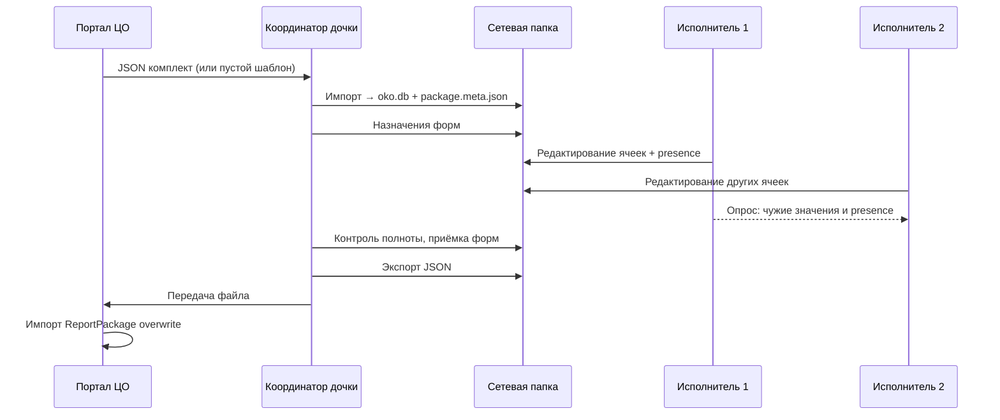

# ТЗ: десктопное приложение «ОКО Заполнение»

Версия документа: **1.0**  
Дата: 2026-06-22  
Статус: черновик для согласования

---

## 1. Назначение

Десктопное приложение для **дочерних организаций**, у которых **нет доступа к веб-порталу ЦО**. Пользователи заполняют единый комплект отчётности (ZID + EID) совместно; данные хранятся в **общей сетевой папке** в SQLite. Координатор дочки выгружает **один JSON-комплект** и передаёт в ЦО для импорта в портал (формат `ReportPackage` v1.1, совместим с «Сводка и импорт»).

Пилотный портал (`portal/`, `server/`) остаётся эталоном по схемам форм, движкам проверок и формату обмена. Десктоп **не дублирует** администрирование ЦО (пользователи портала, агрегация, аудит ЦО).

---

## 2. Цели и ограничения

| Цель | Критерий |
|------|----------|
| Совместное заполнение | Несколько пользователей одновременно работают с одним комплектом |
| Одна форма — несколько человек | Разные ячейки одной формы; блокировка активной ячейки |
| Офлайн в периметре дочки | Достаточно доступа к `\\fileserver\oko\...`, интернет не обязателен |
| Обмен с ЦО | Импорт/экспорт JSON без потери данных |
| Win + Linux | Установщик под Windows 10+ и актуальные дистрибутивы Linux |

| Ограничение | Пояснение |
|-------------|-----------|
| Не real-time уровня Google Sheets | Задержка синхронизации 2–5 с (опрос БД) |
| SQLite на SMB/NFS | Допустимо при коротких транзакциях и WAL; не более ~15 одновременных клиентов на один комплект |
| Одна ячейка — один редактор | Второй пользователь видит занятость, не параллельный ввод в ту же ячейку |

---

## 3. Роли

| Роль | Права |
|------|--------|
| **Исполнитель** | Открыть комплект, список форм, редактирование назначенных (или всех — настройка комплекта), сохранение ячеек, статус формы «готово» |
| **Координатор** | Всё то же + назначение форм исполнителям, контроль полноты, бэкап БД, **экспорт JSON в ЦО**, разблокировка «зависших» ячеек |

Идентификация пользователя в дочке:

- имя из ОС (`USERNAME` / `displayName`) + опционально выбор из списка при первом входе в комплект;
- роль «координатор» — PIN или пароль в `package.meta.json` (не связан с учётками портала ЦО).

---

## 4. Структура сетевой папки комплекта

Один комплект = одна папка. Имя по соглашению: `{код_орг}_{период}`, например `Romashka_2026Q2`.

```
\\fileserver\oko\Romashka_2026Q2\
  package.meta.json      # метаданные комплекта (ZID, EID, организация)
  oko.db                 # SQLite — все данные комплекта
  assignments.json       # опционально: назначение форм исполнителям
  backups\               # копии oko.db (координатор)
  exports\               # выгруженные JSON для ЦО
  .oko\                  # служебное (версия схемы БД, lock-файл приложения)
```

### 4.1. `package.meta.json`

```json
{
  "formatVersion": 1,
  "zid": 12,
  "eid": 202604,
  "organization": "ООО Ромашка",
  "periodStart": "2026-04-01",
  "periodEnd": "2026-04-30",
  "enterpriseCode": "1@1",
  "createdAt": "2026-04-01T10:00:00Z",
  "coordinatorPinHash": "…",
  "settings": {
    "heartbeatIntervalSec": 5,
    "presenceStaleSec": 30,
    "syncPollIntervalSec": 3,
    "restrictExecutorsToAssignments": true
  }
}
```

### 4.2. `assignments.json` (опционально)

```json
{
  "updatedAt": "2026-04-05T12:00:00Z",
  "items": [
    { "templateId": "N01_01", "assignee": "ivanov", "status": "in_progress" },
    { "templateId": "N06_12", "assignee": "petrov", "status": "ready" }
  ]
}
```

Статусы назначения: `assigned` | `in_progress` | `ready` | `accepted` (принято координатором).

---

## 5. База данных `oko.db`

Схема **наследует пилот** (`data/schema.sql`, `form_instances`, `form_cell_values`) с расширениями для совместной работы и аудита на уровне ячейки.

### 5.1. Существующие сущности (без изменения смысла)

- `form_instances` — экземпляры форм комплекта (76 шт. после «создать комплект»).
- `form_cell_values` — значения ячеек (`instance_id`, `row_no`, `column_key`, `value_num`, `value_text`).

Справочники и правила **вшиты в приложение** (как в пилоте: `schemas/*.json`, `checks.json`, `rash-rules.json`, `kontr.json`) или кэшируются в БД при первом открытии комплекта. Редактирование правил в дочке **не предусмотрено**.

### 5.2. Расширение `form_cell_values`

Добавить столбцы:

| Столбец | Тип | Назначение |
|---------|-----|------------|
| `updated_at` | TEXT (ISO 8601) | Время последнего сохранения ячейки |
| `updated_by` | TEXT | `user_name` из клиента |

Индекс:

```sql
CREATE INDEX idx_cells_updated ON form_cell_values(instance_id, updated_at);
```

Уникальность сохраняется: `UNIQUE (instance_id, row_no, column_key)`.

### 5.3. Таблица `cell_presence` (эфемерное присутствие)

Не хранит значения формы — только **кто сейчас на какой ячейке**.

```sql
CREATE TABLE cell_presence (
  instance_id   TEXT NOT NULL,
  row_no        INTEGER NOT NULL,
  column_key    TEXT NOT NULL,
  user_name     TEXT NOT NULL,
  machine_name  TEXT,
  client_id     TEXT NOT NULL,
  heartbeat_at  TEXT NOT NULL,
  PRIMARY KEY (instance_id, row_no, column_key)
);

CREATE INDEX idx_presence_instance ON cell_presence(instance_id);
CREATE INDEX idx_presence_heartbeat ON cell_presence(heartbeat_at);
```

- `client_id` — UUID сессии приложения (генерируется при запуске).
- Одна ячейка — одна запись (PRIMARY KEY). При переходе пользователя на другую ячейку старая запись **удаляется**, новая **вставляется**.

### 5.4. Таблица `form_instance_status` (опционально, для координатора)

Если не использовать только `form_instances.status`:

| Поле | Значения |
|------|----------|
| `executor_status` | `draft` \| `ready` — готовность исполнителя |
| `accepted_by` | координатор, дата приёмки |

Можно обойтись полем `status` в `form_instances` (`draft` / `ready` / `accepted`) без отдельной таблицы.

### 5.5. Таблица `local_audit` (журнал дочки)

```sql
CREATE TABLE local_audit (
  id          INTEGER PRIMARY KEY AUTOINCREMENT,
  action      TEXT NOT NULL,
  instance_id TEXT,
  row_no      INTEGER,
  column_key  TEXT,
  actor       TEXT NOT NULL,
  details     TEXT,
  created_at  TEXT NOT NULL
);
```

События: `cell_save`, `presence_force_unlock`, `export_json`, `backup_db`, `import_package`.

### 5.6. Параметры SQLite при открытии

```sql
PRAGMA journal_mode = WAL;
PRAGMA busy_timeout = 5000;
PRAGMA synchronous = NORMAL;
```

---

## 6. Протокол heartbeat и присутствия

### 6.1. Жизненный цикл фокуса ячейки

1. Пользователь входит в ячейку `(instance_id, row_no, column_key)`.
2. Клиент в **транзакции**:
   - удаляет свои предыдущие записи в `cell_presence` для этого `client_id`;
   - проверяет чужие записи на целевую ячейку с `heartbeat_at` свежее порога (`presenceStaleSec`);
   - если занята — **отказ**, UI: «Ячейка занята: {user_name}»;
   - иначе `INSERT OR REPLACE` в `cell_presence`.
3. Пока ячейка в фокусе — **heartbeat** каждые `heartbeatIntervalSec` (по умолчанию 5 с): `UPDATE cell_presence SET heartbeat_at = ? WHERE client_id = ? AND …`.
4. При `blur` / переходе на другую ячейку / закрытии формы — `DELETE FROM cell_presence WHERE client_id = ?`.
5. При аварийном завершении — запись устаревает через `presenceStaleSec` (30 с), ячейка снова доступна.

### 6.2. Очистка «мёртвых» записей

Любой клиент при опросе (раз в 30 с) выполняет:

```sql
DELETE FROM cell_presence
WHERE heartbeat_at < datetime('now', '-30 seconds');
```

(порог из `package.meta.json`).

### 6.3. Принудительная разблокировка (координатор)

Действие «Снять блокировку» на ячейке/форме: `DELETE FROM cell_presence WHERE instance_id = ? [AND row_no = ? …]` + запись в `local_audit`. Только после ввода PIN координатора.

### 6.4. Формы с контрагентами (N06/N09)

Для строк расшифровки блокировка на уровне **`(instance_id, row_no)`** — вся строка контрагента, а не одна графа. В `cell_presence` при `kontr_form = 1` использовать `column_key = '*'` (соглашение).

---

## 7. Протокол синхронизации данных

Модель: **опрос БД** (без WebSocket). Клиенты не общаются напрямую.

### 7.1. Сохранение ячейки

При подтверждении ввода (`blur` или Enter):

```sql
INSERT INTO form_cell_values (...)
ON CONFLICT(instance_id, row_no, column_key) DO UPDATE SET
  value_num = excluded.value_num,
  value_text = excluded.value_text,
  updated_at = excluded.updated_at,
  updated_by = excluded.updated_by;
```

Транзакция &lt; 50 ms. После успеха — локально обновить `lastKnownUpdatedAt` для ячейки.

### 7.2. Получение чужих изменений

Каждые `syncPollIntervalSec` (3 с), пока открыта форма:

```sql
SELECT row_no, column_key, value_num, value_text, updated_at, updated_by
FROM form_cell_values
WHERE instance_id = ?
  AND updated_at > ?
ORDER BY updated_at;
```

`?` — watermark `lastSyncAt` (ISO UTC).

**Правила применения на клиенте:**

| Условие | Действие |
|---------|----------|
| Ячейка не в фокусе у текущего пользователя | Обновить значение на экране |
| Ячейка в фокусе, пользователь не менял значение с последнего sync | Обновить |
| Ячейка в фокусе, есть несохранённый ввод | **Не перезаписывать**; после `blur` — переспросить |
| `updated_by` = текущий пользователь | Игнорировать (уже локально) |

### 7.3. Получение присутствия

В том же цикле опроса:

```sql
SELECT row_no, column_key, user_name, machine_name, heartbeat_at
FROM cell_presence
WHERE instance_id = ?
  AND client_id != ?
  AND heartbeat_at >= datetime('now', '-30 seconds');
```

### 7.4. Пересчёт формул (FTotal, выражения)

После применения чужих ячеек — локальный пересчёт (`recalcEngine` из пилота). Ячейка в фокусе с несохранённым вводом не участвует в перезаписи итоговых строк до `blur`.

### 7.5. Конфликт одной ячейки

Редкий случай: два клиента сохранили одну ячейку с разницей &lt; 1 с (после снятия блокировки).

- Побеждает запись с **более поздним `updated_at`**.
- Проигравший клиент: тост «Значение обновлено пользователем {updated_by}» + подсветка ячейки жёлтым на 3 с.
- Запись в `local_audit` с `action = 'cell_conflict_resolved'`.

---

## 8. Экраны приложения

### 8.1. Стартовый экран — подключение к комплекту

- Поле пути (с кнопкой «Обзор…») к сетевой папке.
- Список **недавних** комплектов (локальный кэш путей).
- Проверки при открытии:
  - есть `package.meta.json` и `oko.db`;
  - папка доступна на запись;
  - версия схемы БД поддерживается приложением.
- Выбор **имени пользователя** (по умолчанию из ОС).
- Кнопки: «Открыть», «Создать комплект из JSON» (импорт от ЦО), «Справка».

### 8.2. Главный экран комплекта

- Шапка: организация, период, ZID/EID.
- **Индикатор связи с папкой** (см. §8.6).
- Сводка: заведено X / 76, готово Y, принято Z (логика как `PackageCompleteness` в портале).
- Список форм (дерево: категория → форма), фильтр «Мои формы» для исполнителя.
- Колонки: название, исполнитель, статус, кто редактирует (если есть presence на форме), % заполнения (опционально).
- Координатор: «Назначения», «Резервная копия», «Экспорт JSON для ЦО».

### 8.3. Редактор формы

Переиспользование UX пилота (`FormPage`): таблица, PDF-образец, подписи, проверка расшифровок.

Дополнительно для совместной работы:

| Элемент UI | Поведение |
|------------|-----------|
| **Чужая активная ячейка** | Рамка цветом пользователя (цвет из хэша `user_name`), подпись `{user_name}` в углу |
| **Своя ячейка** | Стандартный фокус |
| **Занятая ячейка** | Курсор `not-allowed`, клик — подсказка с именем |
| **Недавно изменённая чужим** | Лёгкая подсветка фона 2 с (опционально) |
| **Панель «В комплекте»** | Аватары/имена пользователей с открытой этой формой |

Кнопки: «Сохранить» (явное сохранение подписей/мета), «Проверить увязки», «Проверить расшифровки», «Отметить готовой» (исполнитель).

### 8.4. Экран координатора — назначения

- Таблица 76 форм, выпадающий список исполнителей.
- Массовое назначение по категории.
- Сохранение в `assignments.json` + опционально в БД.

### 8.5. Экспорт JSON для ЦО

- Доступно только координатору (PIN).
- Перед экспортом: предложить бэкап `oko.db` → `backups/oko_{timestamp}.db`.
- Сборка `ReportPackage` v1.1 (`buildReportPackage` из пилота): все `form_instances` комплекта, строки из `form_cell_values`, подписи.
- Имя файла: `oko_package_{org}_{period}.json` → `exports/`.
- Проверки перед выгрузкой: список незаполненных / форм со статусом не `accepted` (предупреждение, не блокер).

### 8.6. Индикатор синхронизации

Строка состояния внизу окна:

| Состояние | Текст | Условие |
|-----------|-------|---------|
| `synced` | Синхронизировано | Последний опрос успешен &lt; 5 с назад |
| `syncing` | Синхронизация… | Идёт запрос к БД |
| `offline` | Нет доступа к папке | Ошибка I/O или таймаут |
| `locked` | База занята, повтор… | SQLite `SQLITE_BUSY` после busy_timeout |
| `error` | Ошибка синхронизации | Прочие ошибки + краткий текст |

Иконка: зелёная / жёлтая / красная точка слева от текста.

---

## 9. Жизненный цикл комплекта



1. **Создание:** импорт JSON от ЦО или «пустой комплект» (76 форм) по метаданным из `package.meta.json`.
2. **Работа:** совместное заполнение.
3. **Приёмка:** координатор переводит формы в `accepted`.
4. **Сдача:** экспорт JSON → ЦО.

---

## 10. Импорт комплекта от ЦО

- Формат: `ReportPackage` v1.1 (`portal/src/engine/packageExport.ts`).
- Действие «Создать/обновить комплект из JSON» в пустой или существующей папке.
- Merge по `templateId`: при совпадении — режим «перезаписать» / «пропустить» (диалог).
- После импорта: пересоздать `package.meta.json` из полей пакета.

---

## 11. Нефункциональные требования

| Параметр | Требование |
|----------|------------|
| Размер установки | ≤ 30 МБ (целевой стек Tauri) |
| Время открытия формы | ≤ 2 с на типовой сети |
| Одновременные клиенты | до 15 на один `oko.db` |
| Кодировка | UTF-8 |
| Логи | локальный файл `%APPDATA%/OKO-Filler/logs/` (без значений ячеек в debug по умолчанию) |
| Обновление приложения | установщик; схема БД — миграции в `.oko/schema_version` |

---

## 12. Технологический стек (рекомендация для реализации)

| Компонент | Выбор |
|-----------|--------|
| UI | React 19 + TypeScript (общие пакеты с пилотом: `engine/`, типы) |
| Оболочка | Tauri 2 (Windows + Linux) |
| SQLite | `rusqlite`, WAL, миграции |
| Сборка | pnpm monorepo: `apps/filler-desktop`, `packages/oko-engine` |

Детальный стек v2 всего OKO — отдельное решение; для десктопа достаточно вынести движки пилота в shared-пакет.

---

## 13. Этапы разработки (MVP)

| Этап | Содержание | Результат |
|------|------------|-----------|
| **M1** | Подключение к папке, SQLite, список форм, редактор одного пользователя, сохранение ячеек | Альфа без совместной работы |
| **M2** | `cell_presence`, heartbeat, опрос изменений, индикатор синхронизации, подсветка чужих ячеек | Совместное заполнение |
| **M3** | Роли, назначения, статусы форм, координатор | Организация работы в дочке |
| **M4** | Импорт/экспорт ReportPackage, проверки, расшифровки, бэкап | Обмен с ЦО |
| **M5** | Установщики, документация, нагрузочный тест 10 клиентов на SMB | Пилот в дочке |

---

## 14. Вне scope (первая версия)

- Прямое подключение к API портала ЦО по сети.
- Редактирование правил checks/saldo/rash в дочке.
- Агрегация нескольких дочек.
- Одновременный ввод в одну ячейку без блокировки.
- Мобильные клиенты.

---

## 15. Критерии приёмки (сводно)

1. Два пользователя на разных ПК открывают одну форму, редактируют **разные** ячейки — значения видны друг другу в течение ≤ 5 с.
2. Второй пользователь **не может** взять ячейку, пока первая в фокусе (presence + heartbeat).
3. После экспорта JSON координатором импорт в портал ЦО восстанавливает все 76 форм без потери значений.
4. Потеря связи с папкой отображается индикатором «Нет доступа к папке»; при восстановлении — автоматический resync.
5. Координатор может снять зависшую блокировку и сделать бэкап БД перед экспортом.

---

## 16. Связь с кодовой базой пилота

| Пилот | Использование в десктопе |
|-------|--------------------------|
| `portal/public/schemas/*` | Шаблоны форм |
| `portal/src/engine/*` | checks, recalc, rash, completeness |
| `portal/src/engine/packageExport.ts` | Экспорт JSON |
| `portal/src/engine/packageImport.ts` | Импорт JSON |
| `data/schema.sql` | Базовая схема `form_instances`, `form_cell_values` |
| `server/src/instances.ts` | Логика save/load ячеек (порт в Rust/TS) |

---

*Документ подлежит согласованию: наименование приложения, пороги heartbeat, обязательность `assignments.json`, политика PIN координатора.*
